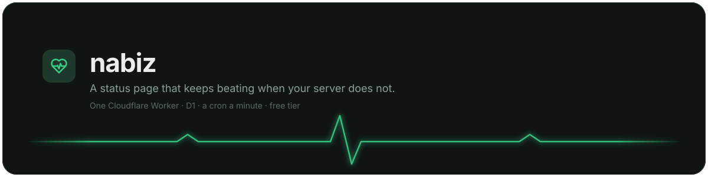
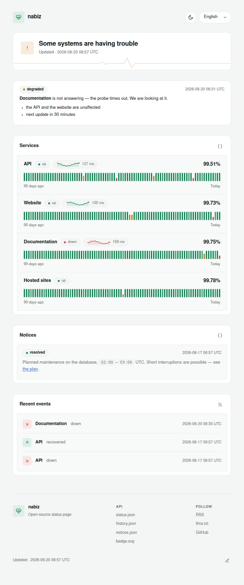

<p align="center">
  
</p>

<h1 align="center">nabiz</h1>

<p align="center">
  A status page that keeps beating when your server does not —<br>
  one Cloudflare Worker, or one container on a machine you own.
</p>

<p align="center">
  <a href="https://github.com/productdevbook/nabiz/actions/workflows/ci.yml"></a>
  <a href="https://github.com/productdevbook/nabiz/releases/latest"></a>
  <a href="https://github.com/productdevbook/nabiz/pkgs/container/nabiz"></a>
  <a href="LICENSE"></a>
</p>

<p align="center">
  <picture>
    <source media="(prefers-color-scheme: dark)" srcset="docs/screenshot-dark.png">
    
  </picture>
</p>

## What it is

Astro renders the page, a probe checks every monitor once a minute, and
the history lives in a database next to it. On Cloudflare that is one
Worker with a cron trigger and D1, inside the free tier. On your own
hardware it is one container with an interval and a SQLite file — same
source, same schema. *nabız* is Turkish for "pulse"; the ASCII spelling
`nabiz` is used throughout.

## Documentation

| | |
|---|---|
| [Cloudflare](docs/cloudflare.md) | deploying the Worker, custom hostname, limits |
| [Self-hosting](docs/self-hosting.md) | Docker, compose, from a checkout |
| [Kubernetes](deploy/k8s/README.md) | manifests, one replica, seeding in-cluster |
| [Monitors](docs/monitors.md) | the rows that say what is watched |
| [Configuration](docs/configuration.md) | every variable, on both runtimes |
| [API](docs/api.md) | JSON, RSS, badge, notices, machine access |
| [Upgrading](docs/UPGRADING.md) | schema additions, moving between runtimes |
| [Installing with an agent](docs/agent-install.md) | a runbook: commands, checks, and what each error means |

## Features

- One probe per monitor per minute: method, expected status, timeout,
  optional body match.
- Anti-flap: a watched monitor is called down after `fail_threshold`
  consecutive failures (default 2); recovery is immediate, and a monitor
  that is already down when first seen is believed at once.
- 90-day uptime bars, and a latency sparkline once there are probes in two
  different hours — it averages by the hour, so a fresh deployment has no
  waveform until the clock crosses one.
- Grouped monitors: one row saying how the group is, never how many it
  speaks for and never their names.
- Operator notices in markdown, with severity and per-language targeting.
- Alerts to Telegram and a webhook on state changes.
- Six languages (en, tr, de, es, fr, zh-CN), light and dark, auto-refresh.
- JSON API, RSS feed, SVG badge, `llms.txt`.

Not included: incident timelines, subscriber emails, multi-region probes.

## Quick start

**On your own machine**

```sh
docker run -d --name nabiz -p 8080:8080 -v nabiz:/data \
  -e NABIZ_TITLE="status" -e ADMIN_TOKEN="$(openssl rand -hex 32)" \
  ghcr.io/productdevbook/nabiz:latest
```

**On Cloudflare**

```sh
git clone https://github.com/productdevbook/nabiz && cd nabiz && bun install
bunx wrangler d1 create nabiz                        # id goes into wrangler.toml
bunx wrangler d1 execute nabiz --remote --file schema.sql
bun run deploy
```

Either way the page comes up empty and working — a heading with nothing
under it is the correct first sight. Monitors are rows you add next, and
the first bar appears within one probe interval: see
[Monitors](docs/monitors.md). Keep the token you generated above; it is what lets you write notices.
Nothing on the page prints it again — `docker inspect nabiz` will, which
is also a reason not to leave it on a machine other people can reach.

## Development

```sh
bun install
bunx wrangler d1 execute nabiz --local --file schema.sql   # once
bun run dev                                                # :4321, local D1
bun run check                                              # what CI runs
```

Everything under `src/lib/` is plain TypeScript against a narrow database
interface (`src/lib/db.ts`) that D1 already satisfies and SQLite is made to
(`src/lib/sqlite.ts`). That seam is the whole difference between the two
runtimes: the page, the probes and the state machine are one copy.

## License

MIT. Icons from [Lucide](https://lucide.dev) (ISC).
