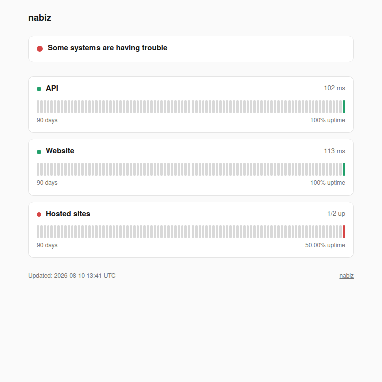

<p align="center">
  
</p>

# nabiz

*From the Turkish **nabız** — "pulse", as in keeping a finger on one. Spelled `nabiz` everywhere, because the dotless ı deserves better than being typed wrong.*

A status page that keeps beating when your server does not. One Cloudflare
Worker probes your endpoints every minute from Cloudflare's edge, keeps the
history in D1, and serves the page itself — so when the machine it watches
goes dark, the page saying so stays up. Fits entirely inside Cloudflare's
free tier.



## What it does

- Probes every monitor once a minute; expected status, timeout and method
  per monitor.
- Ninety days of uptime bars per monitor, a live latency figure, an overall
  banner.
- **Grouped monitors**: hosts you serve but do not own are shown only as a
  tally — "6/6 up" — never by name. A public status page does not have to
  be a public customer list.
- A Telegram message and/or a webhook on every state change — on the
  change, not on every minute of an outage — with how long the previous
  state had held.
- English and Turkish out of the box.

## What it deliberately does not do

Incident timelines, subscriber emails, multi-region probes: that is what
the paid status products are for, and if you need them, buy one. This is
the other end of the trade — a single file of SQL away from understood,
running where the outage cannot reach it, for nothing.

## Setup

```sh
git clone https://github.com/productdevbook/nabiz && cd nabiz
bun install                              # or npm / pnpm
wrangler d1 create nabiz                 # put the id into wrangler.toml
wrangler d1 execute nabiz --remote --file schema.sql
wrangler deploy
```

Then tell it what to watch — monitors are rows, not config, because this
repository is public and your hostnames are yours:

```sql
INSERT INTO monitors (slug, name, url, group_name, grouped, position) VALUES
  ('api',    'API',        'https://api.example.com/health', NULL, 0, 1),
  ('site-a', 'customer a', 'https://a.example',  'Hosted sites', 1, 10),
  ('site-b', 'customer b', 'https://b.example',  'Hosted sites', 1, 11);
```

```sh
wrangler d1 execute nabiz --remote --command "INSERT INTO monitors …"
```

Optional, for alerts:

```sh
wrangler secret put TELEGRAM_BOT_TOKEN
wrangler secret put TELEGRAM_CHAT_ID
wrangler secret put ALERT_WEBHOOK_URL
```

To serve it on your own hostname, uncomment the `routes` line in
`wrangler.toml` — Cloudflare creates the DNS record and the certificate.

## Limits worth knowing

- The free tier allows 50 subrequests per invocation: keep it under ~45
  monitors, or split the cron.
- Probes come from Cloudflare's edge. If the target is behind Cloudflare
  too, you are measuring edge-to-origin — still an honest availability
  check, not a full user path.
- Days are counted in UTC.

## License

MIT
